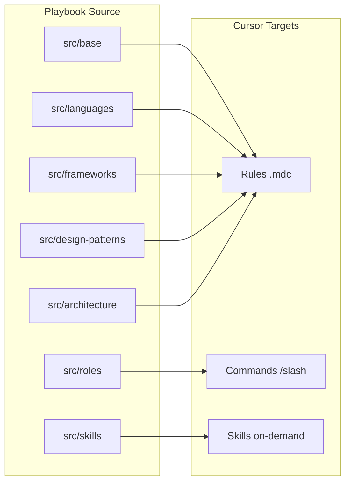

# Celestial AI Playbook — Integration Guide

Supports **Cursor**, **Claude Code**, **GitHub Copilot**, and **Antigravity** from one `src/` source of truth.

## Multi-IDE adapter mapping

| IDE / Tool | CLI command | Rules output | Roles output | Skills |
|---|---|---|---|---|
| **Cursor** | `install` + `sync` + `export-roles` | `.cursor/rules/*.mdc` | `~/.cursor/commands/` or `.cursor/commands/` | `~/.cursor/skills/` |
| **Claude Code** | `export-claude` + `export-roles` | `CLAUDE.md` | `.claude/commands/*.md` | — |
| **GitHub Copilot** | `export-copilot` + `export-roles` | `.github/copilot-instructions.md` | `.github/prompts/*.prompt.md` | — |
| **Antigravity** | `export-antigravity` + `export-roles` | `.rules/*.md` | `.agent/presets/*.md` *(experimental)* | — |
| **All** | `install-all` | All rule targets | All role targets | Cursor only |

Architecture overlays (`src/architecture/*.md`) are included in **all** exports when listed in the project's `.ai-playbook.json`:

```json
{ "architecture": ["control-plane", "carecaddy"] }
```

Without that config, only global rules export (24 rules). With overlays enabled, up to 27 rules.

### Cursor-only: Skills

**Skills** (`src/skills/`) remain Cursor-only (`~/.cursor/skills/`). Other IDEs can reference skill content manually in `CLAUDE.md` or project docs.

## Role export pipeline (cross-IDE)

Canonical source: `src/roles/*.md` → frontmatter parser → normalized role object → per-IDE renderers.

```bash
ai-playbook export-roles                          # all targets → cwd
ai-playbook export-roles --target cursor          # single target
ai-playbook export-roles --target claude,copilot  # comma-separated
ai-playbook export-roles --project ../my-service  # write into another dir
ai-playbook verify-roles                          # run export checks
```

### Role metadata schema

Each `src/roles/*.md` file may include YAML frontmatter. All fields are optional — fallback defaults are applied for any missing field.

```yaml
---
id: roles/pr-reviewer
kind: role
name: pr-reviewer
title: PR Reviewer
description: Rigorous code review enforcing security, isolation, performance and coverage
command: celestial-pr-reviewer
scope: global
targets:
  cursor:
    enabled: true
    type: command
  claude:
    enabled: true
    type: command
  copilot:
    enabled: true
    type: prompt
  antigravity:
    enabled: true
    type: preset
---
```

| Field | Type | Default (when absent) |
|---|---|---|
| `id` | string | `roles/<filename>` |
| `kind` | `"role"` | `"role"` (validated — must be `"role"`) |
| `name` | string | filename without extension |
| `title` | string | Title-cased filename |
| `description` | string | First heading or paragraph from body (strips `ROLE:` prefix) |
| `command` | string | `celestial-<filename>` (validated — must be kebab-case) |
| `scope` | `"global"` \| `"project"` | `"global"` |
| `targets` | object | All IDEs enabled with default types (see below) |

### Targets structure

Each target has `enabled` (boolean) and `type` (string). Set `enabled: false` to skip a role for a specific IDE.

| Target | Default `type` | Valid types |
|---|---|---|
| `cursor` | `command` | `command`, `skill` |
| `claude` | `command` | `command` |
| `copilot` | `prompt` | `prompt` |
| `antigravity` | `preset` | `preset` |

### Normalized role object

Every role file is normalized into this shape before being passed to renderers:

```json
{
  "id": "roles/backend",
  "kind": "role",
  "name": "backend",
  "title": "Backend",
  "description": "Backend Developer",
  "command": "celestial-backend",
  "scope": "global",
  "targets": {
    "cursor":      { "enabled": true, "type": "command" },
    "claude":      { "enabled": true, "type": "command" },
    "copilot":     { "enabled": true, "type": "prompt" },
    "antigravity": { "enabled": true, "type": "preset" }
  },
  "body": "...(markdown content after frontmatter)...",
  "sourcePath": "src/roles/backend.md"
}
```

### Adapter mapping

| Target | Output path | Generated frontmatter | Generated notice |
|---|---|---|---|
| `cursor` | `.cursor/commands/celestial-*.md` | None | `<!-- AUTO-GENERATED ... -->` |
| `claude` | `.claude/commands/celestial-*.md` | `description`, `disable-model-invocation` | `<!-- AUTO-GENERATED ... -->` |
| `copilot` | `.github/prompts/celestial-*.prompt.md` | `description`, `name`, `agent` | `<!-- AUTO-GENERATED ... -->` |
| `antigravity` | `.agent/presets/celestial-*.md` | `name`, `title`, `description`, `type` | `<!-- AUTO-GENERATED ... -->` |

### Example: one source → four outputs

**Source:** `src/roles/backend.md` (no frontmatter — all fallback defaults)

| IDE | Generated file |
|---|---|
| Cursor | `.cursor/commands/celestial-backend.md` |
| Claude | `.claude/commands/celestial-backend.md` |
| Copilot | `.github/prompts/celestial-backend.prompt.md` |
| Antigravity | `.agent/presets/celestial-backend.md` |

All generated files include:

```html
<!-- AUTO-GENERATED by celestial-ai-playbook (export-roles). Do not edit; modify src/roles/ instead. -->
```

### Cursor-only primitives (legacy section)

## The three Cursor primitives

Not everything in the playbook is a Skill. Cursor has three distinct mechanisms:

| Primitive | What it is | When to use | Cursor location |
|---|---|---|---|
| **Rule** | Persistent standards and constraints | HOW code is written — always-on, file-scoped, or intelligently applied | `.cursor/rules/*.mdc` |
| **Skill** | Deep on-demand workflow | Complex methodologies the agent loads when a task matches | `~/.cursor/skills/<name>/SKILL.md` |
| **Command** | Explicit slash invocation | Persona switches and repeatable workflows you trigger with `/` | `~/.cursor/commands/*.md` |



## Taxonomy (source of truth: `playbook.manifest.json`)

### Rules (27) — standards

| Category | Examples | Apply mode |
|---|---|---|
| `base/` | global-rules | Always apply |
| `languages/` | typescript, python, go | File globs (`**/*.ts`) |
| `frameworks/` | nestjs, react-next | File globs or intelligent |
| `design-patterns/` | api-design, resiliency | Intelligent (description) |
| `data-layers/` | sql, nosql, graph | File globs or intelligent |
| `cloud-ai/` | ai-safety, orchestration | Intelligent |
| `architecture/` | control-plane, carecaddy | **Project-only** |

### Skills (4) — workflows

| Skill | Use when |
|---|---|
| `celestial-observability` | Building logging, tracing, metrics, SLOs |
| `celestial-performance-tuning` | Fixing slow queries, N+1, latency |
| `celestial-threat-modeling` | Security analysis, STRIDE, attack surface |
| `celestial-domain-driven-design` | Bounded contexts, aggregates, domain events |

### Commands (14) — personas

Type `/` in chat to invoke:

| Command | Persona |
|---|---|
| `/celestial-backend` | Senior backend developer |
| `/celestial-frontend` | Frontend developer |
| `/celestial-devops` | DevOps engineer |
| `/celestial-dba` | Database administrator |
| `/celestial-qa` | QA engineer |
| `/celestial-review-pr` | PR reviewer |
| `/celestial-architect` | System architect |
| `/celestial-go` | Go engineer |
| `/celestial-integration` | Integration engineer |
| `/celestial-data-engineer` | Data engineer |
| `/celestial-ai-ml` | AI/ML specialist |
| `/celestial-ui-ux` | UI/UX designer |
| `/celestial-end-user` | End user advocate |

## 6-layer composition

```
Layer 1  base/global-rules.md     → Rule (always apply)
Layer 2  domain overlay            → Rule (future)
Layer 3  architecture/*.md        → Rule (project-only)
Layer 4  tenant overlay            → Rule (future)
Layer 5  environment overlay       → Rule (future)
Layer 6  roles → Commands, skills → Skills
         languages/frameworks      → Rules (file-scoped)
         design-patterns           → Rules (intelligent)
```

## Setup workflow

### 1. Install globally (once)

```bash
./install.sh
ai-playbook install
```

Cursor only — writes commands, skills, and rule templates to `~/.cursor/`.

### 2. Sync / export per project

```bash
cd your-project

# Cursor
ai-playbook sync

# Claude, Copilot, Antigravity rules + roles
ai-playbook export-claude
ai-playbook export-copilot
ai-playbook export-antigravity
ai-playbook export-roles              # roles → .cursor/.claude/.github/.agent
ai-playbook install-all               # all IDEs (rules + roles)
ai-playbook verify-roles              # test role export pipeline
```

`install-all` runs Cursor global install, then Cursor sync **when run from a project repo** (has `.git` or `.ai-playbook.json`), plus Claude/Copilot/Antigravity exports to the current directory.

### 3. Daily usage (Cursor)

```
/celestial-backend          → adopt backend persona for this task
/celestial-review-pr        → review current changes
"optimize this endpoint"    → celestial-performance-tuning skill auto-loads
```

## Adding new components

1. Create source file: `ai-playbook create skills my-new-skill`
2. Add entry to `playbook.manifest.json` with correct `type`: `rule`, `skill`, or `command`
3. Re-run `ai-playbook install` and `ai-playbook sync`

## Decision guide: rule vs skill vs command?

| Question | If yes → |
|---|---|
| Should this always influence coding style? | **Rule** |
| Should this apply when editing specific file types? | **Rule** (with globs) |
| Is this a methodology the agent applies when relevant? | **Skill** |
| Do you explicitly invoke this to switch mode? | **Command** |
| Is this a one-shot workflow (review PR, dry-run)? | **Command** |
