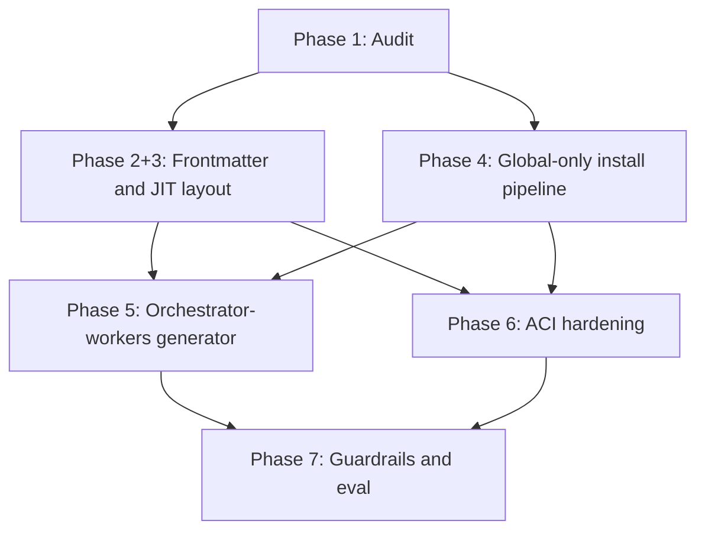

# Plan Dependencies — Multi-Phase Refactor DAG

Corrected dependency graph per GAP 1 remediation. **Do not run Phases 2–7 strictly sequential** when parallel tracks are independent.

## Required parallel schedule (GAP 1)

```text
Phase 1 (Audit) — alone
        │
        ├──────────────────┬──────────────────┐
        ▼                  ▼                  ▼
  Phase 2+3            Phase 4           (optional)
  (one track:          (global-only
   frontmatter +       install pipeline)
   JIT layout)
        │                  │
        └────────┬─────────┘
                 ▼
        ┌────────┴────────┐
        ▼                 ▼
   Phase 5           Phase 6
   (generator)       (ACI hardening)
        │                 │
        └────────┬────────┘
                 ▼
            Phase 7 (eval/guardrails) — alone
```

## Mermaid view



## Per-phase dependencies

| Phase | Hard depends on | Can run in parallel with |
|-------|-----------------|--------------------------|
| 1 Audit | — | — |
| 2+3 Frontmatter + JIT | 1 | **Phase 4** |
| 4 Global-only install | 1 | **Phase 2+3** |
| 5 Generator | 2+3, 4 | **Phase 6** |
| 6 ACI | 4 | **Phase 5** (after 4) |
| 7 Eval/guardrails | 5, 6 | — |

## Internal Phase 4 note

Phase 4 has two sub-steps with different deps:

| Sub-step | Depends on | Notes |
|----------|------------|-------|
| 4a Remove project writes, global paths | Phase 1 only | Parallel with 2+3 |
| 4b Wire `resolveSkill` into install | Phase 3 | After JIT resolver exists |

## False dependencies (do not block)

| Assumed blocker | Reality |
|-----------------|---------|
| Phase 4 needs Phase 2 role rewrites | `load-roles.mjs` has `@trigger` fallbacks |
| Phase 5 needs Phase 6 | Generator and ACI are independent after Phase 4 |
| Phase 7 must wait for all content rewrites | Eval can run on pipeline; content scaffolds deferred |

## Evidence gates per phase

| Phase | Independent smoke |
|-------|-------------------|
| 2 | `npm run eval:smoke:phase2` |
| 3 | `npm run eval:smoke:phase3` |
| 4 | `npm run eval:smoke:phase4` |
| 5 | `npm run eval:smoke:phase5` |
| 6 | `npm run eval:smoke:phase6` |
| 7 | `npm run eval:all` |
